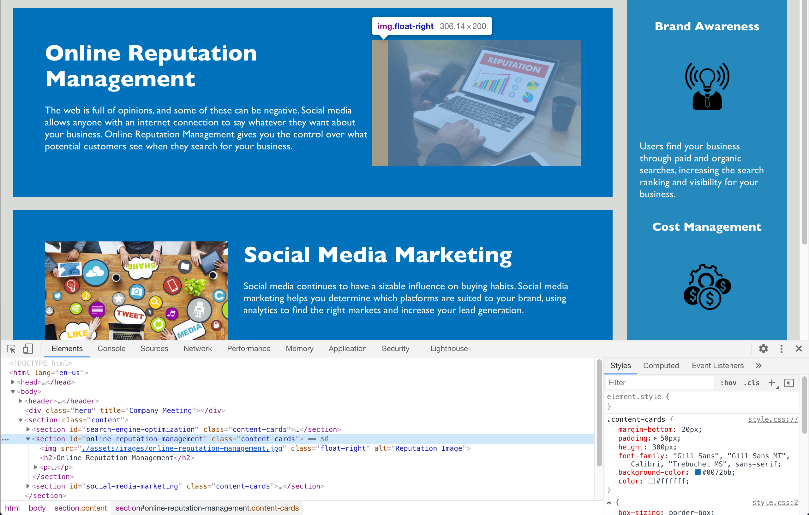

# Code Refactor Project

This repo is the result of an exercise in refactoring a hypothetical company's website in order to make it more accessible.
Accessibility is a very important aspect of modern web development as it enables many more people to utilize the web. Plus, it increases SEO scores and protects against potential legal concerns.

What I did to make this site more accessible:
- Replaced generic `
` tags with semantic tags such as `<section>`, `<aside>`, & `<footer>`
- Ordered the HTML elements in a logical, easy-to-follow manner
- Removed redundant css classes and ordered the style.css sheet to follow the HTML structure
- Fixed all broken page links
- Added `alt` attributes to all `img` tags

Please check out the final result [here](https://nicholasrokosz.github.io/code-refactor/).